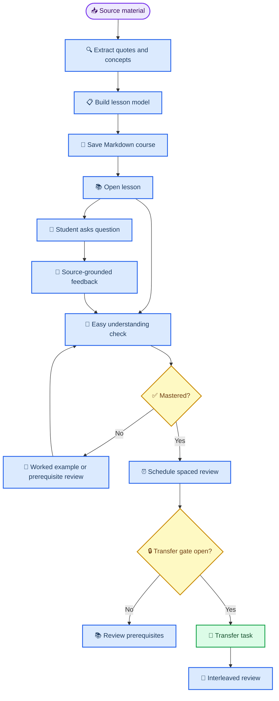

# SourceMind first draft

_A first implementation draft for a source-grounded lesson engine that combines a small set of high-evidence learning methods without turning the product into a grab bag._

---

## 📋 Thesis

SourceMind builds a structured model of what a student needs to learn, decomposes it into prerequisite concepts and transfer skills, then uses retrieval practice, spacing, mastery gates, worked examples, self-explanation, and interleaving to guide the student from source-grounded understanding to flexible application.

The product should not try to include every learning-science idea. Version 1 should focus on a coherent instructional loop:

1. Generate the course work once during ingestion
2. Store a durable lesson model as local Markdown
3. Teach one small lesson at a time with worked examples and source quotes
4. Let the student ask questions during the lesson
5. Check understanding with small easy retrieval questions
6. Use mastery gates before transfer tasks unlock
7. Schedule review with spacing and confidence-aware priority
8. Interleave related skills only after foundations are stable

This makes SourceMind a lesson engine, not only a flashcard app.

## 🧠 Evidence-backed method stack

The core design should use only methods that are either high-utility or directly recommended by education evidence guides. Dunlosky et al. rated practice testing and distributed practice as high utility, while self-explanation, elaborative interrogation, and interleaved practice were rated moderate utility and should be used in appropriate situations rather than everywhere.[^1] The What Works Clearinghouse recommends spacing learning over time, alternating worked examples with problem solving, connecting concrete and abstract representations, using quizzes for re-exposure, and asking deep explanatory questions.[^2]

| Method | SourceMind role | Why it is needed | V1 restraint |
| --- | --- | --- | --- |
| Retrieval practice | Main check-for-understanding mechanism | Students need to pull answers from memory, not just read explanations | Use short-answer and simple recall checks before complex prompts |
| Spacing | Review scheduler | Durable learning needs delayed review across days and weeks | Schedule only concepts, misconceptions, and transfer tasks; avoid over-scheduling every sentence |
| Mastery gates | Prerequisite control | Transfer tasks fail if the foundation is unstable | Gate only meaningful prerequisites, not every tiny fact |
| Worked examples | Initial teaching support | Novices need to see correct reasoning before open problem solving | Fade help gradually after successful checks |
| Self-explanation | Understanding probe | Students should explain why an answer works and what source supports it | Use after worked examples or wrong answers, not after every interaction |
| Interleaving | Transfer strengthening | Students need to distinguish when to use related concepts | Start after the student has passed basic retrieval for each mixed concept |

SourceMind should explicitly avoid low-return study features in v1: highlighting, passive rereading, generic summaries, learning-style personalization, and broad AI tutoring without source checks. Those can make the app feel busy while weakening the thesis.

## 🏗️ Lesson model

A SourceMind course should be created up front during ingestion. Study sessions should load the prebuilt lesson model, not regenerate lessons every time the student opens a subject.

Each subject should contain a course-level structure:

| Layer | Purpose | Examples |
| --- | --- | --- |
| Source quotes | Evidence boundary | Verbatim quote, page ref, source title |
| Core concepts | Foundational knowledge | Definitions, mechanisms, formulas, rules |
| Prerequisite graph | Learning order | `L2_01` requires `L1_01` and `L1_02` |
| Worked examples | Guided first contact | Solved problem, annotated reasoning, source-backed explanation |
| Retrieval checks | Easy questions | Recall, identify, define, match, fill short answer |
| Misconception checks | Confident-wrong detection | Common trap, contrast case, why-not question |
| Transfer tasks | Application | New scenario, mixed problem, explain-from-principles task |
| Review schedule | Spacing state | Due date, interval, confidence history, mastery percent |

The smallest useful lesson should include:

- One learning objective
- Two to five source-backed concepts
- One worked example
- Three easy retrieval checks
- One misconception check
- One self-explanation prompt
- One transfer task locked behind prerequisites

## ⚙️ First-build behavior

### Course generation

Course generation should happen when a PDF or source bundle is uploaded. The pipeline should:

1. Extract source quotes with references
2. Identify core concepts from those quotes
3. Split concepts into foundation and transfer levels
4. Build prerequisite dependencies
5. Generate worked examples for each major concept
6. Generate easy retrieval checks for each concept
7. Generate misconception checks for likely confusions
8. Generate transfer tasks for higher-level application
9. Save the entire course model to Markdown

The generation step may use local PDF extraction, NotebookLM when available, and Ollama for structuring. The durable Markdown course is the authority after generation. Runtime study should not depend on calling the ingestion model again.

### Lesson experience

Inside a lesson, the student should see a short source-grounded explanation, then a worked example. The student can ask questions about a specific quote, step, concept, or answer. SourceMind should answer with a visible support status:

| Status | Meaning |
| --- | --- |
| Grounded | Directly supported by stored source quotes |
| Inferred | Reasonably derived from mastered prerequisites |
| Outside scope | Not safely supported by the course model |

After explanation, SourceMind should ask small questions until the student demonstrates enough confidence and correctness to proceed. The first checks should be easy on purpose: the goal is to verify the foundation, not surprise the student.

### Student model

The student model should track mastery per concept, not only per subject. Each concept should store:

- Mastery percent
- Last score
- Confidence history
- Review interval
- Failure streak
- Related misconceptions
- Unlocked transfer tasks

High-confidence wrong answers should be prioritized because they identify false fluency. Low-confidence correct answers should also be reviewed, but less urgently.

### Adaptive loop

The lesson loop should be:

1. Teach with source quote and worked example
2. Ask an easy retrieval check
3. Collect answer and confidence
4. Give source-grounded feedback
5. If wrong, show misconception or prerequisite support
6. If correct but low confidence, repeat later with spacing
7. If correct and confident, update mastery
8. Unlock transfer only when prerequisites reach the gate
9. Interleave related concepts after basic mastery

This keeps the methods in conjunction: retrieval reveals current understanding, feedback repairs it, spacing preserves it, mastery gates sequence it, worked examples reduce early overload, self-explanation tests the reasoning link, and interleaving strengthens selection under realistic conditions.

## 🧩 Implementation game plan

### Phase 1: Extend the Markdown schema

Add first-class lesson entities to the Markdown subject format. Keep the existing competency, quote, and SRS concepts, but add sections for:

- `LESSON_MODEL`
- `WORKED_EXAMPLES`
- `RETRIEVAL_CHECKS`
- `MISCONCEPTIONS`
- `TRANSFER_TASKS`
- `LESSON_STATE`

Each generated task should have a stable ID so the backend can track mastery and review history without regenerating content.

### Phase 2: Build the lesson generator

Create a backend service that converts extracted source material into the lesson model. The generator should produce conservative output:

- If evidence is missing, mark the item as `needs_review`
- If a transfer task has no prerequisite, keep it locked
- If a worked example cannot be grounded, omit it rather than hallucinate it

### Phase 3: Add lesson APIs

Add endpoints for:

- Listing lessons for a subject
- Opening a lesson
- Asking a source-grounded question inside a lesson
- Evaluating a retrieval check
- Unlocking or blocking a transfer task
- Returning the next due review item

### Phase 4: Build the lesson UI

The lesson UI should have four stable zones:

- Concept and source evidence
- Worked example
- Ask-a-question thread
- Understanding checks

The student should not have to choose between “study mode” and “ask mode.” Asking questions is part of the lesson.

### Phase 5: Add verification and evaluation

Add tests that prove:

- Courses are generated once and saved
- Lessons load from Markdown without regeneration
- Retrieval checks update mastery and spacing state
- Transfer tasks remain locked until prerequisites pass the gate
- High-confidence wrong answers are prioritized
- Ask-a-question responses show grounded, inferred, or outside-scope status

## ✅ Acceptance criteria

The first working draft is successful when:

- A PDF upload creates a saved subject with a durable lesson model
- A subject can be reopened without regenerating lessons
- A lesson shows source quotes, one worked example, and easy checks
- The student can ask a question about the current lesson
- Feedback distinguishes grounded, inferred, and outside-scope claims
- Correctness and confidence update per-concept mastery
- Transfer tasks are blocked until prerequisites meet the gate
- Interleaved review only appears after the relevant concepts have basic mastery
- Tests cover the course-generation, lesson-loading, retrieval, gating, and feedback paths

## ⚠️ Risks and guardrails

| Risk | Mitigation |
| --- | --- |
| Too many methods make the product shallow | Treat retrieval, spacing, and mastery gates as core; add worked examples, self-explanation, and interleaving only where they serve the lesson |
| AI generates unsupported lessons | Require every concept and explanation to reference source quotes or mark it outside scope |
| Lessons feel like tests instead of learning | Start each lesson with a worked example and let students ask questions before checks |
| Gating frustrates students | Show exactly which prerequisite blocks transfer and offer a short review path |
| Interleaving appears too early | Require basic mastery before mixing problem types |
| Markdown schema becomes hard to maintain | Use stable IDs, typed validation, and small sections rather than free-form generated prose |

## 🚫 Explicit non-goals for v1

- Do not claim SourceMind improves fluid intelligence
- Do not personalize by learning styles
- Do not build a general chatbot detached from source material
- Do not regenerate the course on every lesson load
- Do not optimize for beautiful summaries before testing retrieval
- Do not add gamification until the lesson loop works
- Do not include every moderate-evidence technique as a separate feature

## 📚 References

[^1]: Dunlosky, J., Rawson, K. A., Marsh, E. J., Nathan, M. J., & Willingham, D. T. (2013). "Improving students' learning with effective learning techniques: Promising directions from cognitive and educational psychology." _Psychological Science in the Public Interest_. https://journals.sagepub.com/doi/10.1177/1529100612453266

[^2]: What Works Clearinghouse. (2007). "Organizing instruction and study to improve student learning." Institute of Education Sciences. https://ies.ed.gov/ncee/wwc/PracticeGuide/1

[^3]: Agarwal, P. K., Nunes, L. D., & Blunt, J. R. (2021). "Retrieval practice consistently benefits student learning: A systematic review of applied research in schools and classrooms." _Educational Psychology Review_. https://link.springer.com/article/10.1007/s10648-021-09595-9

[^4]: National Academies of Sciences, Engineering, and Medicine. (2018). "How People Learn II: Learners, Contexts, and Cultures." https://nap.nationalacademies.org/catalog/24783/how-people-learn-ii-learners-contexts-and-cultures
